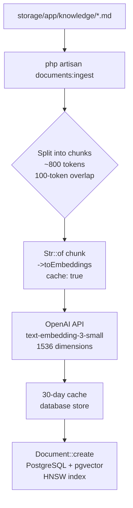
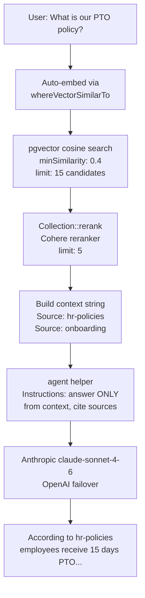
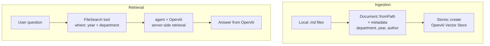

# Internal Documentation Assistant

A production-ready **Retrieval-Augmented Generation (RAG)** application built with
**Laravel 13** and the official **`laravel/ai` SDK**. Employees ask natural-language
questions and get cited answers from internal documentation — powered by
**pgvector + Anthropic + OpenAI + Cohere**.

---

## Table of Contents

1. [What is RAG?](#what-is-rag)
2. [Why RAG Instead of Fine-Tuning?](#why-rag-instead-of-fine-tuning)
3. [Where Can You Use RAG?](#where-can-you-use-rag)
4. [Architecture Overview](#architecture-overview)
5. [Two RAG Paths](#two-rag-paths)
6. [File Tree](#file-tree)
7. [Prerequisites](#prerequisites)
8. [Setup Guide](#setup-guide)
9. [API Reference](#api-reference)
10. [Running Tests](#running-tests)
11. [Observability](#observability)
12. [Frontend Branches](#frontend-branches)
13. [Key Concepts Reference](#key-concepts-reference)
14. [Commit History — Step-by-Step Learning Path](#commit-history--step-by-step-learning-path)

---

## What is RAG?

**Retrieval-Augmented Generation (RAG)** is a pattern that makes Large Language
Models (LLMs) answer questions using your own private data — not just what they
were trained on.

### The Problem RAG Solves

LLMs like Claude or GPT-4 are trained on public internet data up to a cutoff date.
They know nothing about:

- Your company's PTO policy
- Your deployment runbook
- Your internal API documentation
- Customer conversations from last week

If you ask Claude "What is our PTO policy?", it will either hallucinate an answer
or say "I don't have access to that information."

### The RAG Solution

RAG adds a **retrieval step** before generation:

1. **Index** your documents: convert them to numerical vectors (embeddings) and
   store them in a vector database
2. **Retrieve**: when a question arrives, find the most relevant document sections
   using vector similarity search
3. **Generate**: inject the retrieved sections into the LLM prompt as context,
   and instruct it to answer ONLY from that context

```
┌─────────────────────────────────────────────────────────────────┐
│                     RAG PIPELINE                                │
│                                                                 │
│  Your Question: "What is our PTO policy?"                       │
│         │                                                       │
│         ▼                                                       │
│  [EMBED] OpenAI text-embedding-3-small converts your question   │
│          into a 1536-dimensional vector (a list of numbers      │
│          that captures semantic meaning)                        │
│         │                                                       │
│         ▼                                                       │
│  [RETRIEVE] pgvector searches 1000s of document chunks in       │
│             milliseconds, returning the 15 most similar ones   │
│         │                                                       │
│         ▼                                                       │
│  [RERANK] Cohere re-scores all 15 with a cross-encoder model   │
│           and returns the top 5 most relevant chunks           │
│         │                                                       │
│         ▼                                                       │
│  [GENERATE] Anthropic Claude receives:                          │
│     "Answer only from this context: [5 chunks of hr-policies]  │
│      Question: What is our PTO policy?"                        │
│         │                                                       │
│         ▼                                                       │
│  Answer: "According to [hr-policies], employees receive         │
│           15 days of PTO in their first year, accruing at      │
│           0.577 days per pay period..."                         │
└─────────────────────────────────────────────────────────────────┘
```

### The Open-Book Exam Analogy

Think of a closed-book exam vs. an open-book exam:

| Approach       | Exam Type      | Knowledge Source    | Can be updated? |
|----------------|----------------|---------------------|-----------------|
| Base LLM       | Closed-book    | Training data only  | No (re-train)   |
| RAG            | Open-book      | Your live documents | Yes (re-ingest) |
| Fine-tuning    | Memorized book | Baked into weights  | No (re-train)   |

RAG is the open-book exam: the model can "look things up" in your documents in
real time, rather than relying on memorized answers.

---

## Why RAG Instead of Fine-Tuning?

Fine-tuning trains the LLM on your data, updating its weights to "bake in" your
company's knowledge. This sounds appealing but has serious drawbacks:

| Concern              | RAG                          | Fine-Tuning                |
|----------------------|------------------------------|----------------------------|
| Update frequency     | Re-ingest in minutes         | Re-train (hours/days)      |
| Cost                 | API calls per query          | Training costs $10k–$100k+ |
| Hallucination risk   | Low (grounded in context)    | High (model may confuse)   |
| Source attribution   | Built-in (cite the chunk)    | Hard — no provenance       |
| Knowledge cutoff     | None — always current        | Frozen at training time    |
| Privacy              | Documents stay in your DB    | Sent to model provider     |
| Interpretability     | You see exactly what was used | Black box                 |

**RAG wins for most internal documentation use cases** because your policies and
runbooks change frequently, citations matter for compliance, and you need to know
why the model said what it said.

---

## Where Can You Use RAG?

RAG is the right pattern when:

- **Internal Q&A**: "How do I request PTO?", "What's the on-call procedure?"
- **Customer Support**: Agents answering questions from a knowledge base
- **Developer Documentation**: "How do I configure the webhook endpoint?"
- **Legal/Compliance**: "What does section 4.2 of the contract say?"
- **Medical Reference**: Clinicians querying drug interaction databases
- **Code Search**: "Show me examples of how we handle payment errors"
- **Security Runbooks**: "What's the incident response procedure for a data breach?"

RAG is NOT the right pattern when:
- The LLM needs to learn a new *task* or *behavior* (use fine-tuning)
- You need real-time data (use function calling / tool use)
- The corpus is too large to retrieve from efficiently (use hierarchical RAG)

---

## Architecture Overview

### Ingestion Flow



**Key concepts:**

- **Chunking** (~800 tokens): Each markdown file is split into overlapping sections.
  Vector search finds the relevant *section*, not the entire document.
- **Embeddings**: Text is converted to a 1536-dimensional float array. Similar
  meanings produce similar vectors — "PTO" and "vacation days" point in nearly
  the same direction in the vector space.
- **HNSW index**: Hierarchical Navigable Small World — finds the nearest vectors
  in milliseconds even with millions of rows.
- **Caching**: Embeddings are cached for 30 days. Re-ingesting the same file
  doesn't hit the OpenAI API again.

---

### Retrieval + Generation Flow (pgvector path)



**Two-stage retrieval:**

1. **Vector search** (recall): Fast approximate nearest-neighbor via HNSW.
   Retrieves 15 candidates — broad net, some false positives expected.
2. **Reranking** (precision): Cohere's cross-encoder scores each of the 15 against
   the query holistically, returning the 5 most truly relevant chunks.

Why two stages? Reranking a cross-encoder is expensive — you can't run it over your
entire corpus. The two-stage approach combines ANN speed with cross-encoder precision.

---

### Provider-Side RAG Flow (Vector Stores path)



**When to use each path:**

| | pgvector path | Vector Stores path |
|--|--|--|
| **Data location** | Your Postgres DB | OpenAI servers |
| **Control** | Full | Limited |
| **Privacy** | On-premises | Data sent to OpenAI |
| **Complexity** | Migration + command | Upload + store ID |
| **Best for** | Production | Prototyping |

---

## File Tree

```
internal-doc-assistant/
├── .env.example                    # All required env vars documented
├── docker-compose.yml              # Postgres 16 + pgvector (one command setup)
├── README.md                       # This file
│
├── app/
│   ├── Console/Commands/
│   │   └── IngestDocumentsCommand.php    # documents:ingest command
│   │       # - Reads *.md from storage/app/knowledge/
│   │       # - Chunks (~800 tokens, 100-token overlap)
│   │       # - Embeds with Str::toEmbeddings(cache: true)
│   │       # - Stores as Document rows
│   │
│   ├── Http/Controllers/
│   │   ├── AskController.php             # POST /ask + GET /ask/stream
│   │   │   # - Step 1: whereVectorSimilarTo (pgvector cosine, minSim: 0.4)
│   │   │   # - Step 2: Collection::rerank (Cohere, limit: 5)
│   │   │   # - Step 3: agent() with Anthropic→OpenAI failover
│   │   │   # - Stream: ->stream()->usingVercelDataProtocol()
│   │   │
│   │   ├── VectorStoreController.php     # POST /vector-store/* (provider-side RAG)
│   │   │   # - Stores::create() + Document::fromPath() + metadata
│   │   │   # - agent() + FileSearch tool + where filter
│   │   │
│   │   └── TokenController.php           # POST /tokens/create (Sanctum token issuance)
│   │
│   ├── Listeners/
│   │   └── AiObservabilityListener.php   # Logs all AI lifecycle events to ai channel
│   │       # - GeneratingEmbeddings / EmbeddingsGenerated
│   │       # - Reranking / Reranked
│   │       # - PromptingAgent / AgentPrompted
│   │
│   ├── Models/
│   │   └── Document.php                  # Eloquent model, embedding cast to array
│   │
│   └── Providers/
│       └── AppServiceProvider.php        # Registers 6 AI observability event listeners
│
├── config/
│   ├── ai.php                      # Providers, embedding cache, proxy URLs
│   └── logging.php                 # Dedicated 'ai' daily channel added
│
├── database/
│   ├── factories/
│   │   └── DocumentFactory.php     # For tests: random 1536-dim unit vectors
│   └── migrations/
│       └── 2026_06_16_*_create_documents_table.php
│           # Schema::ensureVectorExtensionExists()
│           # vector('embedding', 1536) + vectorIndex('embedding') [HNSW+cosine]
│
├── routes/
│   └── api.php                     # All /api/* routes with documentation
│
├── storage/app/knowledge/
│   ├── engineering-runbook.md      # Sample: deployment, on-call, incidents
│   ├── hr-policies.md              # Sample: PTO, remote work, reviews, benefits
│   └── onboarding.md              # Sample: day-1 setup, team rituals
│
└── tests/
    ├── Pest.php                    # Pest config: TestCase + RefreshDatabase
    ├── Feature/
    │   ├── AskControllerTest.php   # POST /ask: auth, validation, RAG pipeline
    │   ├── AskStreamTest.php       # GET /ask/stream: auth, SSE response
    │   ├── IngestCommandTest.php   # documents:ingest: chunking, embedding, --fresh
    │   └── VectorStoreTest.php     # /vector-store/*: Stores::fake() assertions
    └── Unit/
        └── DocumentChunkerTest.php # chunk() method: boundary snapping, overlap
```

---

## Prerequisites

- PHP 8.2+
- Composer 2
- Docker (for Postgres + pgvector) OR PostgreSQL 16 with pgvector extension
- API keys for:
  - [Anthropic](https://console.anthropic.com/) (text generation)
  - [OpenAI](https://platform.openai.com/) (embeddings + Vector Stores path)
  - [Cohere](https://dashboard.cohere.com/) (reranking)

---

## Setup Guide

### 1. Clone and Install Dependencies

```bash
git clone <repo-url> internal-doc-assistant
cd internal-doc-assistant
composer install
```

### 2. Configure Environment

```bash
cp .env.example .env
php artisan key:generate
```

Edit `.env` and fill in your API keys:

```dotenv
# Database (see docker-compose.yml defaults)
DB_CONNECTION=pgsql
DB_HOST=127.0.0.1
DB_PORT=5432
DB_DATABASE=doc_assistant
DB_USERNAME=postgres
DB_PASSWORD=secret

# AI Providers (all three are required)
ANTHROPIC_API_KEY=sk-ant-...
OPENAI_API_KEY=sk-...
COHERE_API_KEY=...
```

### 3. Start Postgres with pgvector

```bash
# Start Postgres 16 + pgvector in a Docker container
docker compose up -d

# Wait for the health check to pass (~5 seconds)
docker compose ps
```

If you prefer a local Postgres, install the [pgvector extension](https://github.com/pgvector/pgvector)
and enable it: `CREATE EXTENSION IF NOT EXISTS vector;`

### 4. Run Migrations

```bash
php artisan migrate
```

This creates:
- `documents` table with pgvector HNSW index
- `personal_access_tokens` table (Sanctum)
- `cache`, `sessions`, `jobs` tables

### 5. Ingest Documents

Place your markdown files in `storage/app/knowledge/` and run:

```bash
php artisan documents:ingest
```

The bundled sample files (engineering-runbook, hr-policies, onboarding) are
already there. You'll see a progress bar as each chunk is embedded.

To re-ingest from scratch:

```bash
php artisan documents:ingest --fresh
```

### 6. Create a User and Get an API Token

```bash
# Create a test user
php artisan tinker
> User::factory()->create(['email' => 'dev@example.com', 'password' => bcrypt('secret')])
> exit

# Get an API token
curl -X POST http://localhost:8000/api/tokens/create \
     -H 'Content-Type: application/json' \
     -d '{"email":"dev@example.com","password":"secret","device_name":"dev"}'
# Response: { "token": "1|abc123..." }
```

### 7. Start the Server and Ask a Question

```bash
php artisan serve

# Ask a question (synchronous)
curl -X POST http://localhost:8000/api/ask \
     -H 'Content-Type: application/json' \
     -H 'Authorization: Bearer 1|abc123...' \
     -d '{"question": "What is the PTO policy?"}'

# Stream the answer (SSE)
curl -N http://localhost:8000/api/ask/stream\?question\=How+do+I+deploy \
     -H 'Authorization: Bearer 1|abc123...'
```

---

## API Reference

### POST `/api/ask`

Runs the full RAG pipeline and returns a JSON response.

**Headers:** `Authorization: Bearer <token>`, `Content-Type: application/json`

**Request body:**
```json
{ "question": "What is the on-call escalation process?" }
```

**Response:**
```json
{
  "answer": "According to [engineering-runbook], the escalation path is: Primary on-call (5 min SLA) → Secondary on-call → Engineering Manager...",
  "sources": ["engineering-runbook"]
}
```

---

### GET `/api/ask/stream`

Same RAG pipeline but streams the answer as SSE tokens.

**Headers:** `Authorization: Bearer <token>`

**Query params:** `?question=<encoded question>`

**Response:** SSE stream in Vercel AI SDK data protocol format.

```
data: "0:\"According\"\n\n"
data: "0:\" to\"\n\n"
data: "0:\" [engineering-runbook],\"\n\n"
...
```

Compatible with:
- Browser `EventSource` API
- Vercel AI SDK `useChat()` hook (React branch)

---

### POST `/api/vector-store/ingest`

Creates an OpenAI Vector Store and uploads all `.md` files from `storage/app/knowledge/`.

**Response:**
```json
{ "store_id": "vs_abc123", "file_count": 3, "status": "ingested" }
```

Save the `store_id` — you'll need it for the ask endpoint.

---

### POST `/api/vector-store/ask`

Queries the OpenAI Vector Store using the FileSearch tool.

**Request body:**
```json
{
  "question": "What is the deployment process?",
  "store_id": "vs_abc123",
  "year": 2026
}
```

**Response:**
```json
{ "answer": "The deployment process requires..." }
```

---

### POST `/api/tokens/create` (public)

Issues a Sanctum personal access token.

**Request body:**
```json
{ "email": "dev@example.com", "password": "secret", "device_name": "dev" }
```

**Response:**
```json
{ "token": "1|abc123..." }
```

---

## Running Tests

```bash
# Run all tests (unit + feature)
php artisan test

# Or run directly with Pest
./vendor/bin/pest

# Run with coverage (requires Xdebug or PCOV)
./vendor/bin/pest --coverage
```

All tests use fakes — no real API keys needed in CI:
- `Embeddings::fake()->preventStrayEmbeddings()` — no OpenAI calls
- `Reranking::fake()` — no Cohere calls
- `Stores::fake()` — no OpenAI Vector Store calls
- `Storage::fake('local')` — in-memory filesystem

---

## Observability

Every AI operation logs structured data to `storage/logs/ai-YYYY-MM-DD.log`:

```bash
# Watch the AI log during a request
tail -f storage/logs/ai-*.log
```

Example log output:

```json
{"message":"AI: generating embeddings","context":{"invocation_id":"inv_abc","input_count":1}}
{"message":"AI: embeddings generated","context":{"invocation_id":"inv_abc","embedding_count":1}}
{"message":"AI: reranking documents","context":{"invocation_id":"inv_xyz","document_count":5}}
{"message":"AI: reranking complete","context":{"invocation_id":"inv_xyz","result_count":5,"top_score":0.9312}}
{"message":"AI: prompting agent","context":{"invocation_id":"inv_def"}}
{"message":"AI: agent responded","context":{"invocation_id":"inv_def","prompt_tokens":2847,"completion_tokens":312,"total_tokens":3159}}
```

Token cost estimation (June 2026 pricing):
- Embeddings: `text-embedding-3-small` = $0.02 / 1M tokens
- Reranking: Cohere `rerank-english-v3.0` = $0.002 / 1K searches
- Generation: Claude Sonnet 4.6 = $3/M input + $15/M output tokens

---

## Frontend Branches

This repo has two branches with different frontend approaches:

### `main` — Blade + Alpine.js

Simple, no-build-step frontend that demos both the sync and streaming endpoints.
Uses native `EventSource` API with Alpine.js for reactivity.

**Run:** `php artisan serve` → open `http://localhost:8000`

### `feature/react-vercel-ai` — React + Vercel AI SDK

Full React frontend using Vercel AI SDK's `useChat()` hook, wired to the
`/api/ask/stream` endpoint via `->usingVercelDataProtocol()`.

**Learning goals:** React state/hooks/JSX, `useChat` hook, Vite + Laravel integration.

```bash
git checkout feature/react-vercel-ai
npm install && npm run dev
```

---

## Key Concepts Reference

| Term | Definition |
|------|-----------|
| **Embedding** | A list of floats that represents text's semantic meaning. Similar meaning → similar vectors. |
| **Vector database** | A database optimized for storing and searching embeddings by similarity. |
| **HNSW** | Hierarchical Navigable Small World — approximate nearest-neighbor index algorithm. Fast, no training needed. |
| **Cosine similarity** | Measures the angle between two vectors (0 = orthogonal, 1 = identical direction). Used by pgvector. |
| **Chunking** | Splitting a large document into smaller pieces (800 tokens here) before embedding. |
| **Overlap** | Repeating the last N tokens of one chunk at the start of the next, preventing information loss at boundaries. |
| **Reranking** | A second-pass scoring step that re-orders retrieval results using a more powerful cross-encoder model. |
| **Cross-encoder** | A model that scores a (query, document) pair together (vs. embedding each independently). More precise but slower. |
| **RAG** | Retrieval-Augmented Generation — retrieve relevant context, inject into LLM prompt, generate grounded answer. |
| **SSE** | Server-Sent Events — HTTP protocol for server→client streaming, used for token-by-token generation. |
| **Vercel AI SDK** | Frontend SDK with `useChat()` hook for streaming LLM responses into React components. |
| **Sanctum** | Laravel's lightweight API token authentication package. |
| **Failover** | Automatic retry with a different provider on rate limits or outages (`[Lab::Anthropic, Lab::OpenAI]`). |

---

## Tech Stack

| Layer | Technology |
|-------|-----------|
| Framework | Laravel 13.15 (PHP 8.5) |
| AI SDK | laravel/ai v0.8.1 |
| Text generation | Anthropic claude-sonnet-4-6 (OpenAI gpt-4o as failover) |
| Embeddings | OpenAI text-embedding-3-small (1536 dims) |
| Reranking | Cohere rerank-english-v3.0 |
| Vector DB | PostgreSQL 16 + pgvector (HNSW index, cosine similarity) |
| Auth | Laravel Sanctum (API tokens) |
| Testing | Pest 4.7 + pest-plugin-laravel 4.1 |
| Dev DB | Docker — pgvector/pgvector:pg16 |

---

## Commit History — Step-by-Step Learning Path

Each commit is atomic and independently reviewable. Follow them in order to
understand how the application is built layer by layer.

```
git log --oneline
```

**`main` branch — shared backend + Blade+Alpine.js frontend**

| # | Commit message (prefix) | What it introduces |
|---|-------------------------|--------------------|
| 1 | `Bootstrap` | Laravel 13.15 + `laravel/ai` v0.8.1 + Pest 4.7 installed; `tests/Pest.php` configured |
| 2 | `Config` | Anthropic/OpenAI/Cohere provider config, 30-day embedding cache, `docker-compose.yml`, dedicated `ai` log channel |
| 3 | `Migration` | `documents` table — `Schema::ensureVectorExtensionExists()`, `vector('embedding', 1536)`, HNSW cosine index |
| 4 | `Model` | `Document` Eloquent model — `embedding` cast to `array`; `DocumentFactory` with 1536-dim unit vectors for tests |
| 5 | `Ingest` | `php artisan documents:ingest` — reads `*.md`, chunks (~800 tokens, 100-token overlap), `Str::toEmbeddings(cache: true)` |
| 6 | `Controllers` | `POST /ask` + `GET /ask/stream` — embed → pgvector → Cohere rerank → `agent()` with Anthropic+OpenAI failover + `->usingVercelDataProtocol()` |
| 6b | `Sanctum` | API token auth — `TokenController`, `HasApiTokens`, `auth:sanctum` middleware on all `/ask/*` and `/vector-store/*` routes |
| 7 | `Vector Stores` | `VectorStoreController` — `Stores::create()`, `Document::fromPath()` + metadata, `FileSearch` tool with `where` filter |
| 8 | `Observability` | `AiObservabilityListener` — 6 SDK event pairs (before/after) logged to `storage/logs/ai-*.log` |
| 9 | `Docs` | 3 sample `.md` files: `engineering-runbook`, `hr-policies`, `onboarding` (each >3000 chars, 2+ chunks each) |
| 10 | `Tests` | 22 Pest tests across 5 files — `Embeddings::fake()`, `Reranking::fake()`, `Stores::fake()`, `Storage::fake()` |
| 11 | `README` | RAG concepts, open-book analogy, Mermaid diagrams, setup guide, API reference, 14-term glossary |
| 12 | `Frontend` | Blade + Alpine.js UI — "Ask" (JSON) + "Stream" (EventSource) buttons; `pint` code style pass |

**`feature/react-vercel-ai` branch — adds React + Vercel AI SDK frontend (3 commits on top of `main`)**

| # | Commit message (prefix) | What it introduces |
|---|-------------------------|--------------------|
| R1 | `Install React` | `npm install react react-dom @ai-sdk/react ai`; `vite.config.js` updated with `@vitejs/plugin-react`, entry changed to `app.jsx` |
| R2 | `POST /api/ask/chat` | New endpoint accepting `useChat()` wire format (`{ messages: [...] }`) — same RAG pipeline, returns Vercel data protocol stream |
| R3 | `DocAssistant component` | `resources/js/app.jsx` (React entry + `createRoot`), `DocAssistant.jsx` with `useChat()` + `useState` + streaming cursor + suggestion chips; Blade shell replaced with `<div id="app">` + `@vite()` |

### How to walk through the commits

```bash
# View the full commit list with short hashes
git log --oneline

# Inspect a specific commit (e.g. the migration commit)
git show <sha>

# See exactly what changed in commit N
git diff <sha>^..<sha>

# Checkout any commit to study it in isolation
git checkout <sha>    # detached HEAD — read-only exploration
git checkout main     # return to latest
```

### Branch plan

| Branch | Frontend | Status |
|--------|----------|--------|
| `main` | Blade + Alpine.js (no build step, native `EventSource`) | ✅ Complete |
| `feature/react-vercel-ai` | React + Vercel AI SDK `useChat()` hook | ✅ Complete |

The shared backend (`POST /ask`, `GET /ask/stream`, `POST /api/ask/chat`) is identical across both branches.
`->usingVercelDataProtocol()` is already on `main` — the React branch just swaps the frontend.
